# Lordly·阅读

  

Lordly·阅读
 
<a href="https://read.lordly.vip/" target="_blank">read.lordly.vip</a>
 
支持「开源阅读」规则的手环在线阅读工具

> 新用户？请查看我们的[使用指南](https://read.lordly.vip/getting-started)。

## 主要功能

1. 自定义书源，自己设置规则，抓取网页数据，规则简单易懂，官网内有开发指南（WIP）。
2. （WIP）列表书架，网格书架自由切换。
3. 书源规则支持搜索及发现（WIP），所有找书看书功能全部自定义，找书更方便。
4. （WIP）支持替换净化，去除广告替换内容很方便。
5. （WIP）支持本地TXT、EPUB阅读，手动浏览，智能扫描。
6. 支持高度自定义阅读界面，切换颜色、行距、段距、加粗等。
7. （WIP）支持多种翻页模式，覆盖、仿真、滑动、滚动等。
8. 软件开源，持续优化，无广告。

## 开源许可

本项目开发过程中很大程度上参考了「[开源阅读](https://github.com/gedoor/legado)」的设计和规则。在此对「开源阅读」的开发者表示感谢。

但本项目在开发过程中并未直接使用或参考「开源阅读」的具体实现（u1s1，看着头疼 www），因此本项目并不是「开源阅读」的分支或衍生项目，不会跟进「开源阅读」的更新，也不受「开源阅读」`GPL-3` 许可证的约束。

经过综合考量，本项目最终使用 `MPL-2.0` 许可证开源，这意味着您可以自由使用、修改、分发本项目的代码，但是您的衍生项目（中使用到本项目的部分以及对本项目的更改）必须使用相同的许可证开源（具体规则以 `MPL-2.0` 协议约束为准）。

## 软件截图

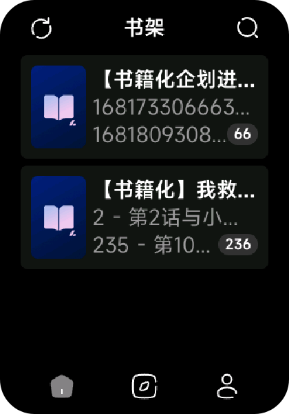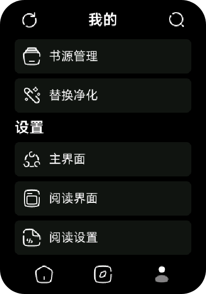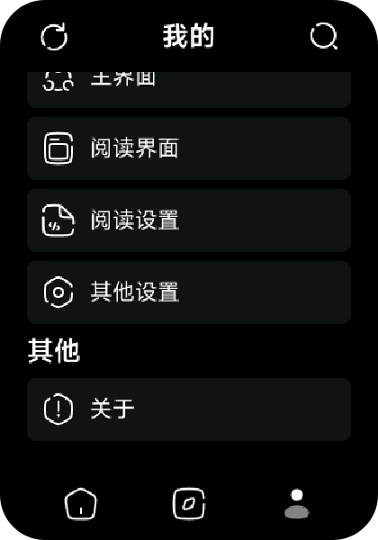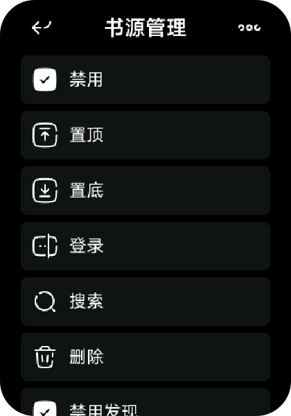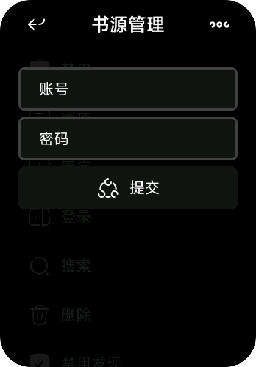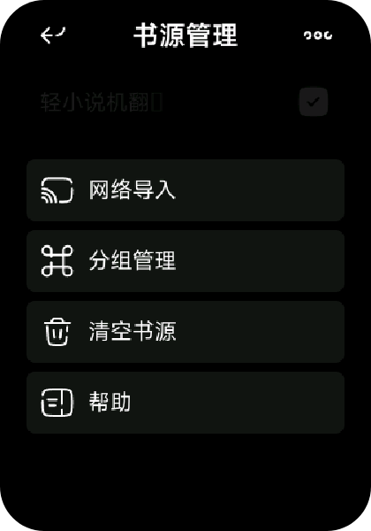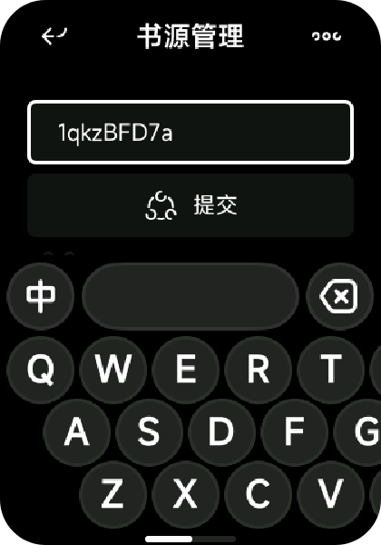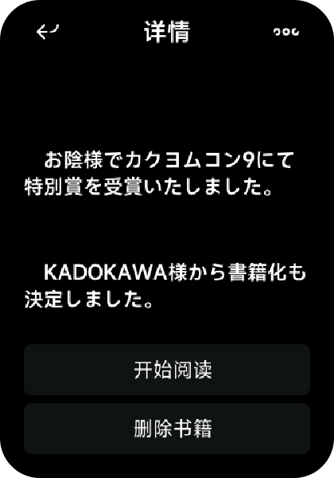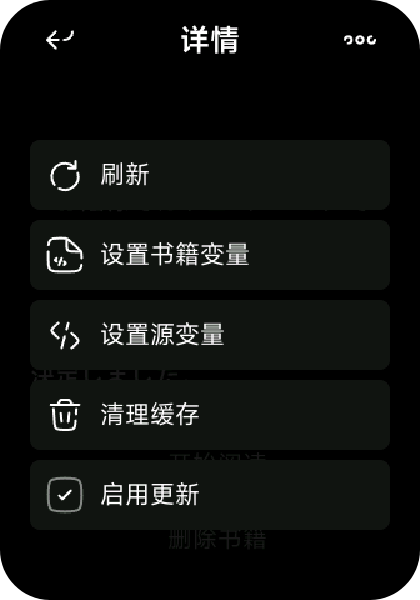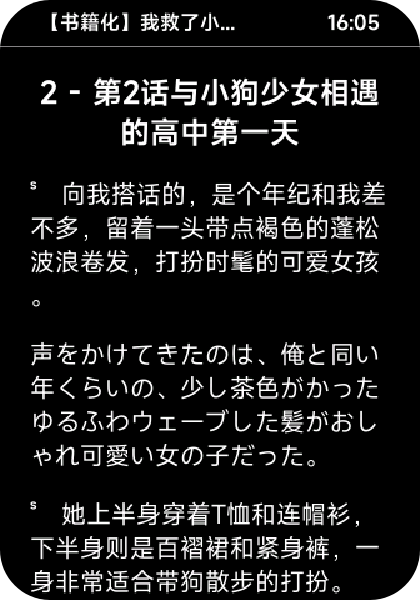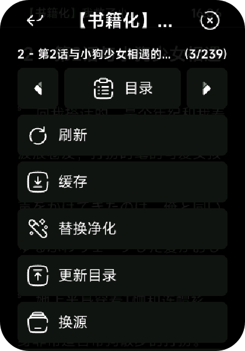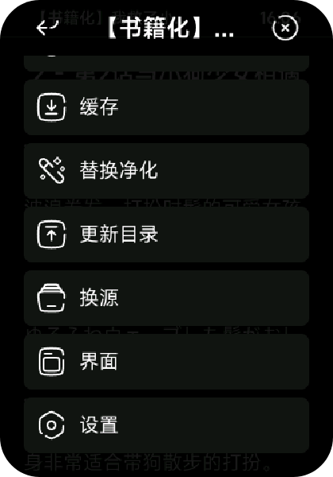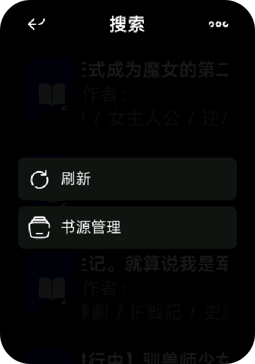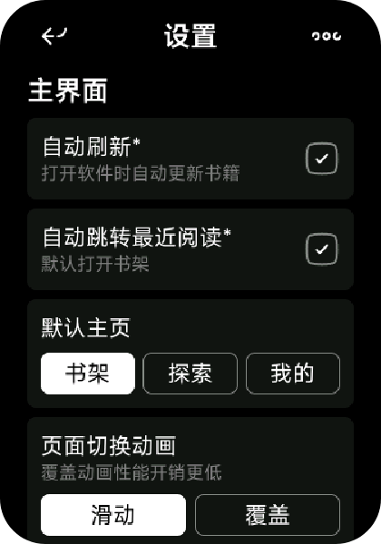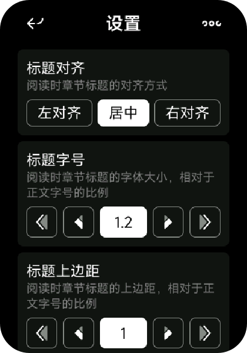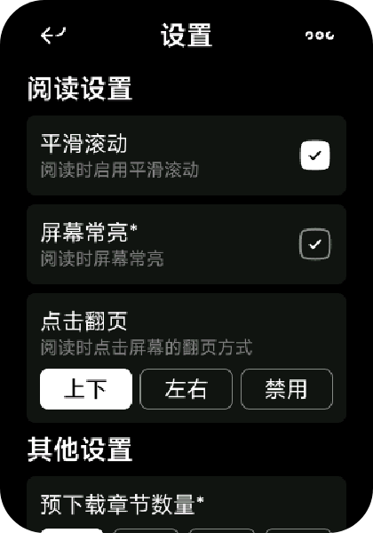

## 免责声明（修改自 [https://gedoor.github.io/Disclaimer](https://gedoor.github.io/Disclaimer)）

    「Lordly·阅读」是一款提供网络文学搜索的工具，为广大网络文学爱好者提供一种方便、快捷舒适的试读体验。
    
    当您搜索一本书的时，「Lordly·阅读」会将该书的书名以关键词的形式提交到各个第三方网络文学网站。各第三方网站返回的内与「Lordly·阅读」无关，「Lordly·阅读」对其概不负责，亦不承担任何法律责任。任何通过使用「Lordly·阅读」而链接到的第三方网页均系他人制作或供，您可能从第三方网页上获得其他服务，「Lordly·阅读」对其合法性概不负责，亦不承担任何法律责任。第三方搜索引擎结果据您提交的书名自动搜索获得并提供试读，不代表「Lordly·阅读」赞成或被搜索链接到的第三方网页上的内容或立场。您应该对用搜索引擎的结果自行承担风险。
    
    「Lordly·阅读」不做任何形式的保证：不保证第三方搜索引擎的搜索结果满足您的要求，不保证搜索服务不中断，不保证搜索结的安全性、正确性、及时性、合法性。因网络状况、通讯线路、第三方网站等任何原因而导致您不能正常使用「Lordly·阅读」，读不承担任何法律责任。「Lordly·阅读」尊重并保护所有使用「Lordly·阅读」用户的个人隐私权，您注册的用户名、电子邮件地址等个人料，非经您亲自许可或根据相关法律、法规的强制性规定，「Lordly·阅读」不会主动地泄露给第三方。
    
    「Lordly·阅读」致力于最大程度地减少网络文学阅读者在自行搜寻过程中的无意义的时间浪费，通过专业搜索展示不同网站中网文学的最新章节。阅读在为广大小说爱好者提供方便、快捷舒适的试读体验的同时，也使优秀网络文学得以迅速、更泛的传播，从而达到了在一定程度促进网络文学充分繁荣发展之目的。阅读鼓励广大小说爱好者通过阅读发现优秀网小说及其提供商，并建议阅读正版图书。
    
    任何单位或个人认为通过阅读搜索链接到的第三方网页内容可能涉嫌侵犯其信息网络传播权，应该及时向阅读提出书权力通知，并提供身份证明、权属证明及详细侵权情况证明。阅读在收到上述法律文件后，将会依法尽快断开相关链内容。

## 联系我们

### QQ 交流群（扫描或点击下方二维码快捷加入）

### GitHub Discussions

GitHub Discussions 地址：https://github.com/Lordly-Tech/LordlyRead/discussions
